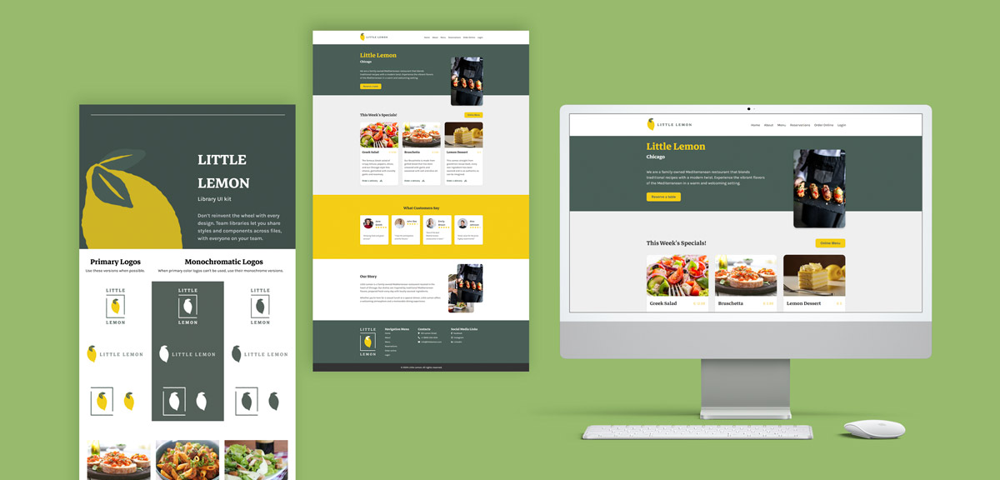

# Little Lemon Table Reservation System


## Overview

This project is the capstone for the Meta Front End Developer Certification. It is a table reservation system for the fictional restaurant Little Lemon, built with React. The application uses semantic HTML and CSS best practices integrated into React components to enhance the user experience and accessibility.

View the [design and component previews on Figma](https://www.figma.com/design/GqVOKP4tg1LIic2D6K2Oz4/Certification-Meta-Project?node-id=14-360&t=PjrMfE4K76iX1PtD-1).

## Learning Objectives

- Set up a React application
- Commit the project into a Git repository
- Plan and implement an effective UI/UX

## Features

- Semantic HTML structure integrated into React JSX
- Responsive web design with CSS Grid and Flexbox
- Meta tags and Open Graph protocol setup for SEO and social media platforms
- Form validation and error handling for user inputs

## Exercises Included

1. **HTML Document Setup:** Implement the foundational semantic HTML elements.
2. **React Components:** Split the application's sections into individual React components like Header, Nav, Main, and Footer.
3. **API Connection:** Set up the components to fetch available reservation times from an API and handle form submissions.
4. **Testing:** Write unit tests for React components to ensure the application functions correctly.
5. **Accessibility:** Enhance accessibility through ARIA attributes and proper labeling.

## Installation

Clone the repository, navigate to the project directory, and install dependencies:

```bash
git clone https://github.com/your-github-username/little-lemon.git
cd little-lemon
npm install
```

## Running the Application

To start the application, run:

```bash
npm start
```

This will launch the application on `http://localhost:3000` where you can view and interact with the web app.

## Contributing

Contributions are welcome. For major changes, please open an issue first to discuss what you would like to change.

Please make sure to update tests as appropriate.

## License

[MIT](https://choosealicense.com/licenses/mit/)
